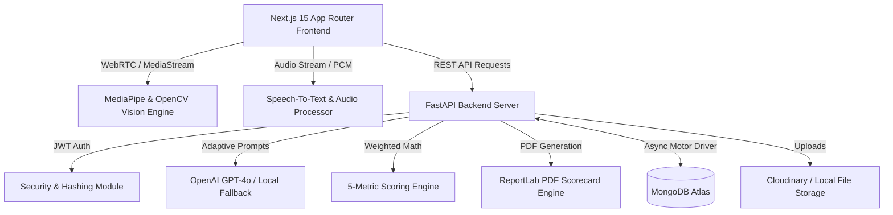

# System Architecture — AI Interviewer Pro

AI Interviewer Pro is designed with a decoupled microservice-ready architecture separating the frontend client presentation layer from the high-throughput Python FastAPI backend and ML inference pipeline.

---

## High-Level Architecture Diagram

---

## Component Roles & Responsibilities

1. **Next.js 15 Frontend (App Router)**:
   - Renders responsive dark-mode user interface using Tailwind CSS and Lucide icons.
   - Captures WebRTC audio and video media streams via HTML5 MediaRecorder and HTML Canvas.
   - Visualizes cognitive gauges and platform analytics with Recharts.

2. **FastAPI Backend Server (Python 3.11)**:
   - Asynchronously processes multipart turn forms containing audio files and canvas image frames.
   - Manages user sessions, JWT token issuing, and authorization.
   - Coordinates ML pipeline tools and persists data to MongoDB Atlas.

3. **Computer Vision & Speech Analytics Pipeline**:
   - **`vision_processor.py`**: Tracks 468 3D face mesh landmarks, computing iris position for eye contact, 3D head pose angles, and smile metrics.
   - **`audio_processor.py`**: Calculates Words Per Minute (WPM), identifies filler words (`um`, `uh`, `like`, `actually`), and measures voice RMS energy.
   - **`stt_engine.py`**: Transcribes input speech using `faster-whisper`.

4. **Weighted Scoring Engine (`scoring.py`)**:
   - Technical Accuracy: 40%
   - Problem Solving: 20%
   - Communication: 20%
   - Confidence: 10%
   - Professionalism: 10%

5. **ReportLab PDF Generator (`pdf_generator.py`)**:
   - Renders placement scorecards into styled PDF documents.
