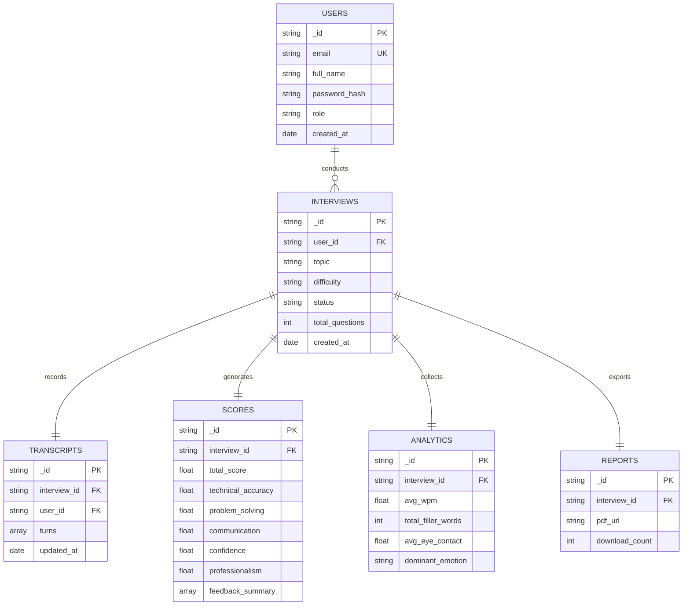

# Database Schema & Entity Diagram — MongoDB Atlas

AI Interviewer Pro uses MongoDB Atlas with 6 primary collections.

---

## Entity Relationship Diagram

---

## MongoDB Collections Detail

1. **`users`**: Stores user authentication credentials, hashed passwords, and roles (`candidate` or `admin`).
2. **`interviews`**: Tracks session parameters (Topic: DSA, DBMS, OOP, OS, CN, HR; Difficulty: Easy, Medium, Hard).
3. **`transcripts`**: Stores sequential turn-by-turn logs including AI questions, candidate responses, turn scores, and evaluation comments.
4. **`scores`**: Stores final weighted scorecard output (40% Technical, 20% Problem Solving, 20% Communication, 10% Confidence, 10% Professionalism).
5. **`analytics`**: Stores aggregate speech and vision metrics across candidate sessions.
6. **`reports`**: Stores generated ReportLab PDF URLs and download metrics.
